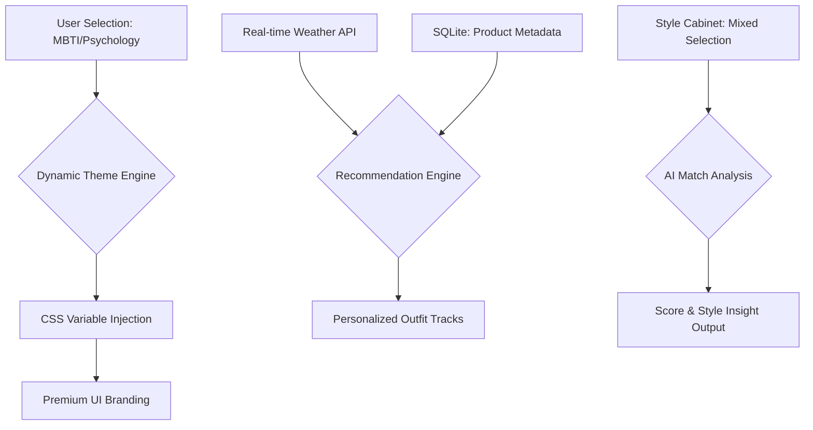

# My AI Closet: Comprehensive User & AI Guide

본 문서는 'My AI Closet' 애플리케이션의 핵심 기능, 아키텍처, 그리고 각 페이지별 정밀 분석을 포함한 종합 가이드입니다. 사용자뿐만 아니라 AI 에이전트가 시스템의 논리 구조를 한눈에 파악할 수 있도록 설계되었습니다.

---

## 1. 서비스 가치 제안 (Value Proposition)
- **개인화된 스타일 DNA**: 유저의 MBTI, 심리 상태, 라이프스타일 페르소나를 결합하여 독창적인 스타일 지표를 생성합니다.
- **실시간 날씨 기반 추천**: 현재 위치의 기온과 기상 상태를 분석하여 최적의 통기성과 스타일을 보장하는 착장을 제안합니다.
*   **시맨틱 클로젯 관리**: 단순 보관이 아닌, 아이템 간의 '매치 점수'를 분석하여 소장 의류의 활용도를 극대화합니다.

---

## 2. 페이지별 정밀 분석 및 가이드

### [Page 01] 에디토리얼 스플래시 (Splash Screen)
- **주요 기능**: 서비스 진입점 및 브랜드 아이덴티티 전달.
- **디자인 포인트**:
  - **테라조 텍스처**: 배경에 웜 그레이톤의 Terrazzo 패턴을 적용하여 프리미엄하고 세련된 무드 연출.
  - **인프라 기술 명시**: "Powered by Local SQLite High-Speed Indexing Engine..." 문구를 통해 데이터 처리의 전문성 강조.
- **가이드**: 사용자는 카카오 또는 구글 계정을 통해 간편하게 로그인할 수 있습니다.

### [Page 02] 스타일 DNA 설정 (Gender & Persona Selection)
- **주요 기능**: 사용자의 기본 성향 및 취향 수집.
- **흐름**:
  1. **성별 선택 (Gender Selection)**: 남성/여성 선택을 통해 의류 데이터베이스 필터링 설정.
  2. **페르소나 선택 (Persona Selection)**: 12종 이상의 라이프스타일 이미지 중 취향에 맞는 페르소나를 선택하여 스타일 DNA 기반 마련.
- **가이드**: 자신의 평소 무드와 가장 가까운 이미지를 선택하면 AI 추천의 정확도가 올라갑니다.

### [Page 03] 메인 대시보드 (Suggestions)
- **주요 기능**: 실시간 날씨와 스타일 DNA를 결합한 종합 코디 제안.
- **상세 데이터**:
  - **Weather Briefing**: Open-Meteo API를 통해 기온, 바람, 체감 온도를 실시간 반영.
  - **Outfit Tracks**: 
    - *Weather-Matched*: 기온 최적화.
    - *Occasion-Based*: 캠퍼스, 오피스, 스트릿, 미니멀 무드로 나누어 제안.
- **가이드**: 하단 내비게이션을 통해 언제든 다른 기능으로 이동할 수 있습니다.

### [Page 04] 시맨틱 클로젯 (Style Cabinet / Mix & Match)
- **주요 기능**: 소장 의류 관리 및 조합 분석.
- **핵심 기술**:
  - **필터 엔진**: 색상, 계절, 스타일별로 의류를 필터링하여 탐색.
  - **AI 매치 분석**: 2개 이상의 아이템을 선택하면 AI가 상호 보완성 및 스타일 정합성을 분석하여 코디 점수를 산출합니다.
- **가이드**: 분석 결과가 만족스럽다면 '조합 저장'을 통해 나만의 아카이브에 보관할 수 있습니다.

### [Page 05] 스타일 아카이브 (Saved Looks)
- **주요 기능**: 저장된 코디 조합 탐색 및 관리.
- **디자인**: 핀터레스트 스타일의 워터폴(Waterfall) 레이아웃을 통해 시각적 즐거움 제공.
- **AI 인사이트**: 저장된 룩들의 패턴을 분석하여 사용자의 선호 스타일(예: 'Urban Utility')을 요약해 보여줍니다.

### [Page 06] 내 정보 및 테마 엔진 (Profile & Theme)
- **주요 기능**: 다이나믹 테마 변경 및 스타일 지표 확인.
- **다이나믹 테마 엔진**:
  - **MBTI & State 연동**: INFJ+CALM (딥 그린), ENFP+ENERGY (네온 오렌지) 등 유저 상태에 따라 앱 전체의 컬러셋이 실시간 변환됩니다.
  - **DNA 레이더 차트**: Active, Clean, Urban 등 스타일 지표를 레이더 차트로 시각화.

---

## 3. 기술 스택 및 데이터 흐름

---

## 4. AI 에이전트를 위한 인터페이스 설명 (Spec for AI)

- **Entry Point**: `/` (Splash)
- **State Management**: React Context / Hooks 기반의 `currentScreen` 상태 변환.
- **Theme Variables**:
  - `--app-primary`: 브랜드 핵심 컬러.
  - `--app-highlight-bg`: 유저 성향별 하이라이트 레이어 그라데이션.
- **Data Source**: 
  - `src/constants.ts`: 정적 의류 및 오피트 데이터셋.
  - `core/recommender.py`: 백엔드 가중치 기반 추천 로직 (SQLite 연동).

---

© 2026 Team Flow - My Shopper. All Rights Reserved.
